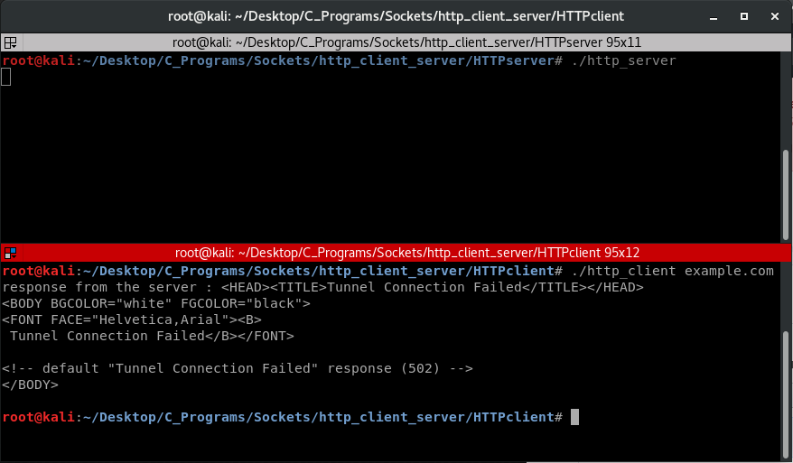

# Http_Client_Server
This repo contains HTTP client and HTTP server written in c using sockets
 
# Installation
just downaload the zip or clone using
```ruby
git clone https://github.com/AwesomeChap/Http_Client_Server.git
```
# Usage   
Navigate to /HTTPserver and open terminal and type
```ruby
gcc HTTPserver.c -o http_server
./http_server
```   
Navigate to /HTTPclient and open another terminal and type
```ruby
gcc HTTPclient.c -o http_client
./http_client <domain>
```   
# Demo
  
